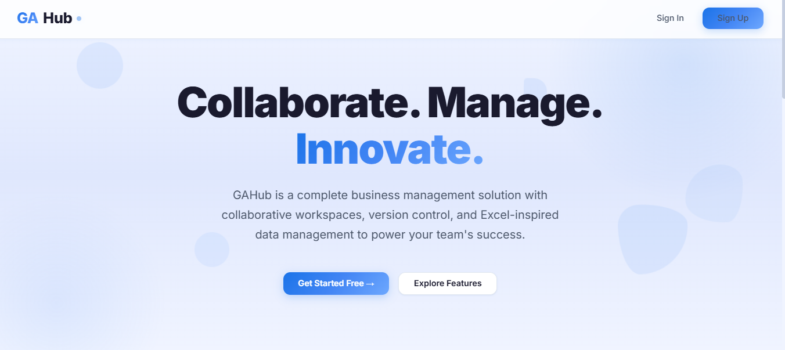
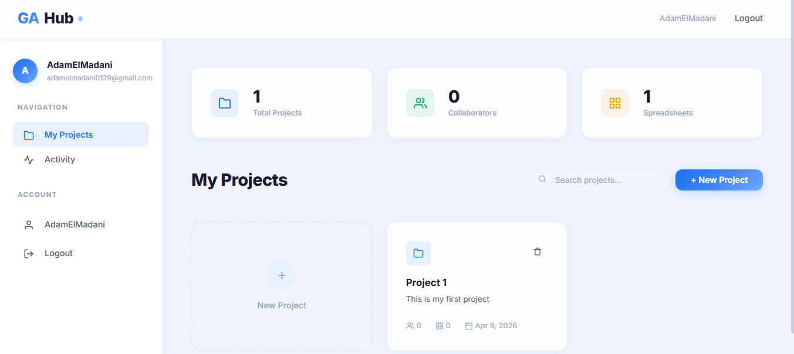

# GAHub


**GAHub** is a complete and integrated business management solution. It features collaborative workspaces, project management, team collaboration, and an Excel-inspired spreadsheet editor — all in a modern, dark-themed interface.

> Built by **Adam El Madani** & **Ghita Bouzrbay**

<div align="center">
  
  
</div>

---

## Features

- **User Authentication** — Secure signup/login with hashed passwords
- **Project Management** — Create, edit, and delete projects
- **Team Collaboration** — Invite collaborators with role-based access (Viewer, Editor, Admin)
- **Spreadsheet Editor** — Create and edit Excel-like spreadsheets in the browser
- **File Upload** — Upload `.xlsx` / `.xls` files and convert them to editable spreadsheets
- **Modern UI** — Dark theme with glassmorphism, gradients, and micro-animations
- **Responsive** — Works on desktop, tablet, and mobile

---

## Tech Stack

| Layer     | Technology                          |
|-----------|-------------------------------------|
| Backend   | Python, Flask, SQLAlchemy           |
| Database  | SQLite (zero-config, file-based)    |
| Auth      | Flask-Login, Werkzeug (bcrypt hash) |
| Frontend  | HTML5, CSS3, Vanilla JavaScript     |
| Fonts     | Google Fonts (Inter)                |
| Excel     | openpyxl (server), SheetJS (client) |

---

## Prerequisites

- **Python 3.8+** — [Download](https://www.python.org/downloads/)
- **pip** — Comes bundled with Python
- **Git** (optional) — For cloning the repo

---

## Local Setup

### 1. Clone the Repository

```bash
git clone https://github.com/Adameelmadani/GAHub.git
cd GAHub
```

### 2. Create a Virtual Environment

```bash
# Windows
python -m venv venv
venv\Scripts\activate

# macOS / Linux
python3 -m venv venv
source venv/bin/activate
```

### 3. Install Dependencies

```bash
pip install -r requirements.txt
```

### 4. Run the Application

```bash
python app.py
```

The app starts at **http://localhost:5000**

### 5. Open in Browser

Navigate to `http://localhost:5000` — you'll see the landing page. Sign up, log in, and start creating projects!

---

## Environment Variables (Optional)

| Variable       | Default                      | Description                 |
|----------------|------------------------------|-----------------------------|
| `SECRET_KEY`   | `gahub-dev-secret-key-...`   | Flask session secret key    |
| `DATABASE_URL` | `sqlite:///gahub.db`         | Database connection string  |
| `PORT`         | `5000`                       | Server port                 |

For production, set a strong `SECRET_KEY`:

```bash
# Windows PowerShell
$env:SECRET_KEY = "your-random-secret-key-here"

# Linux / macOS
export SECRET_KEY="your-random-secret-key-here"
```

---

## Deployment

### Option A — Render (Free Tier)

1. Push your code to GitHub
2. Go to [render.com](https://render.com) → **New Web Service**
3. Connect your GitHub repo
4. Settings:
   - **Runtime**: Python
   - **Build Command**: `pip install -r requirements.txt`
   - **Start Command**: `python app.py`
5. Add environment variable: `SECRET_KEY` = your secret
6. Deploy!

### Option B — Railway

1. Go to [railway.app](https://railway.app) → **New Project** → **Deploy from GitHub**
2. Select your repo
3. Railway auto-detects Python — add a `Procfile`:
   ```
   web: python app.py
   ```
4. Add env vars: `SECRET_KEY`, `PORT` (Railway sets PORT automatically)
5. Deploy!

### Option C — VPS (e.g., DigitalOcean, AWS EC2)

```bash
# SSH into your server
ssh user@your-server-ip

# Clone and setup
git clone https://github.com/Adameelmadani/GAHub.git
cd GAHub
python3 -m venv venv
source venv/bin/activate
pip install -r requirements.txt

# Run with gunicorn (production WSGI server)
pip install gunicorn
gunicorn -w 4 -b 0.0.0.0:5000 "app:create_app()"
```

For production, use **nginx** as a reverse proxy in front of gunicorn.

---

## Project Structure

```
GAHub/
├── app.py                  # Flask entry point
├── models.py               # SQLAlchemy database models
├── routes.py               # All routes (pages + API)
├── requirements.txt        # Python dependencies
├── README.md               # This file
├── templates/
│   ├── base.html           # Base template (navbar, flash)
│   ├── landing.html        # Landing / home page
│   ├── login.html          # Login page
│   ├── signup.html         # Signup page
│   └── dashboard.html      # Main dashboard
├── static/
│   ├── css/
│   │   └── style.css       # Complete design system
│   └── js/
│       └── app.js          # Client-side logic
```

---

## API Reference

All API routes require authentication (session cookie).

| Method   | Endpoint                                    | Description              |
|----------|---------------------------------------------|--------------------------|
| `GET`    | `/api/projects`                             | List user's projects     |
| `POST`   | `/api/projects`                             | Create project           |
| `PUT`    | `/api/projects/:id`                         | Update project           |
| `DELETE` | `/api/projects/:id`                         | Delete project           |
| `GET`    | `/api/projects/:id/collaborators`           | List collaborators       |
| `POST`   | `/api/projects/:id/collaborators`           | Add collaborator         |
| `DELETE` | `/api/collaborators/:id`                    | Remove collaborator      |
| `GET`    | `/api/projects/:id/spreadsheets`            | List spreadsheets        |
| `POST`   | `/api/projects/:id/spreadsheets`            | Create spreadsheet       |
| `GET`    | `/api/spreadsheets/:id`                     | Get spreadsheet data     |
| `PUT`    | `/api/spreadsheets/:id`                     | Update spreadsheet       |
| `DELETE` | `/api/spreadsheets/:id`                     | Delete spreadsheet       |
| `POST`   | `/api/upload-excel`                         | Upload Excel file        |
| `GET`    | `/api/users/search?q=`                      | Search users             |

---

## License

This project is licensed under the MIT License - see the [LICENSE](LICENSE) file for details.
